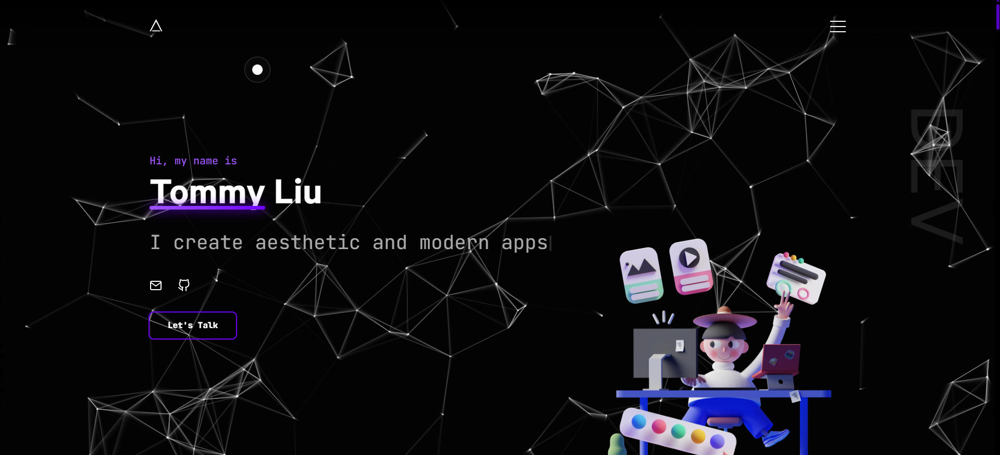

# devfolio

👨‍🎓 An eye-catching developer Portfolio, Built on NextJS, GSAP, Tailwind and React

### ✨ [Live Demo](https://tommy-liu-product-portfolio.vercel.app)

## Getting Started

In the project directory, you can run:

#### `bun install`

#### `bun dev`

Runs the app in the development mode.\
Open [`http://localhost:3000`](http://localhost:3000) to view it in the browser.

## Design

You can always draw inspiration from the design, and no, you don't have to give me credits for that.

## Forking

When people ask me whether they may use the code for their own website, I typically say yes as long as they provide proper attribution.

Every time I learn that someone has duplicated my website without giving me credit, it saddens me. This version of my website took a significant amount of work to construct, and I'm pleased of it! All I ask is that you empathize with my situation and leave the footer unaltered.

